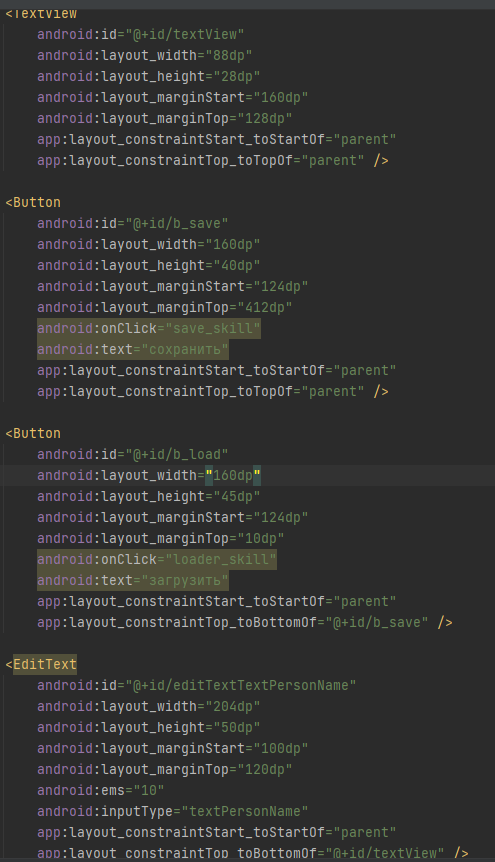
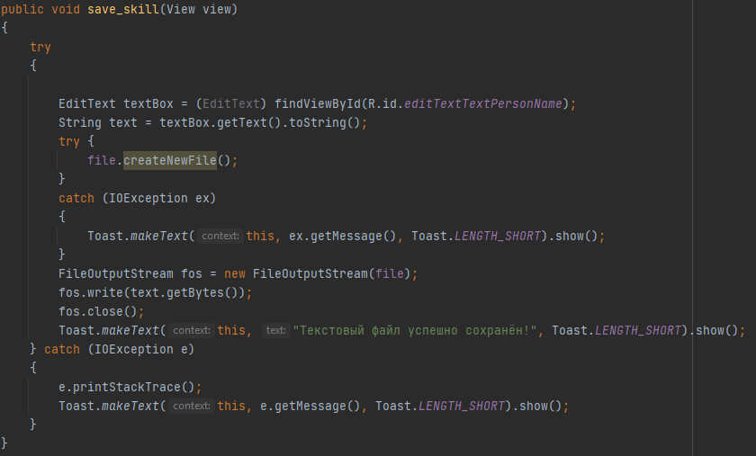
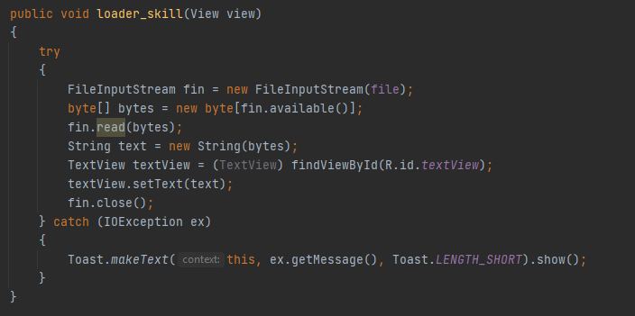
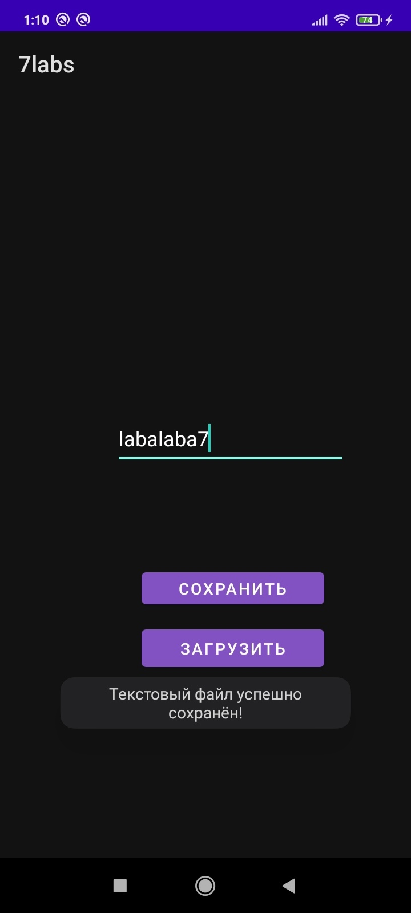
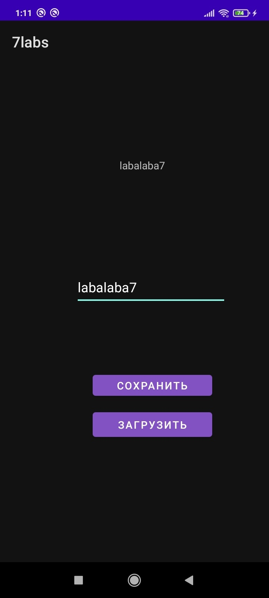

# Деревцов Илья 803в1

Создаем приложение, добавляем две кнопки и два текстовых окна

</img>
        
Сохранение в файл:

</img>  

Загрузка из файла

</img>  
    
проверка работы

</img>  

</img>  
